# Descargando e instalando R y RStudio

En este artículo, te guiaré para descargar e instalar R y RStudio en sistema operativo Ubuntu Linux.

## Paso 1. Descargar R en Ubuntu Linux

Para comenzar, necesitarás descargar el paquete de instalación de R desde el sitio web oficial de R. Abre tu navegador web y sigue este enlace: [Enlace de descarga de R](https://cloud.r-project.org/)

> R es un lenguaje de programación ampliamente utilizado en la comunidad estadística y de análisis de datos, y es especialmente popular entre los científicos de datos y los investigadores.

{#fig-}

## Paso 2. Instalar R en Ubuntu Linux

Los paquetes para la versión actual de R 4.2 están disponibles para la mayoría de las versiones estables de Ubuntu Desktop. Sin embargo, solo la última versión de Soporte a Largo Plazo (LTS) cuenta con soporte completo. A partir del 2 de mayo de 2022, las versiones compatibles son:

-   Jammy Jellyfish (22.04, solo amd64)
-   Impish Indri (21.10, solo amd64)
-   Focal Fossa (20.04; LTS y solo amd64)
-   Bionic Beaver (18.04; LTS)
-   Xenial Xerus (16.04; LTS)

Ejecuta estas líneas (si eres `root`, omite `sudo`) para informar a Ubuntu sobre los binarios de R en CRAN.

``` bash
# Actualizar índices
sudo apt update -qq
# Instalar dos paquetes auxiliares necesarios
sudo apt install --no-install-recommends software-properties-common dirmngr
# Agregar la clave de firma (de Michael Rutter) para estos repositorios
# Para verificar la clave, ejecuta: gpg --show-keys /etc/apt/trusted.gpg.d/cran_ubuntu_key.asc
# Huella digital: E298A3A825C0D65DFD57CBB651716619E084DAB9
wget -qO- https://cloud.r-project.org/bin/linux/ubuntu/marutter_pubkey.asc | sudo tee -a /etc/apt/trusted.gpg.d/cran_ubuntu_key.asc
# Agregar el repositorio de R 4.0 de CRAN -- ajustar 'focal' a 'groovy' o 'bionic' según sea necesario
sudo add-apt-repository "deb https://cloud.r-project.org/bin/linux/ubuntu $(lsb_release -cs)-cran40/"
```

Aquí utilizamos `lsb_release -cs` para acceder a la versión de Ubuntu que estás utilizando: "jammy", "impish", "focal", "bionic", ...

Luego, ejecuta

``` bash
sudo apt install --no-install-recommends r-base
```

## Obtén más de 5000 paquetes de CRAN

Ejecuta este comando (como `root` o agregando `sudo` como prefijo) para agregar el repositorio actual de R 4.0 o posterior 'c2d4u':

``` bash
sudo add-apt-repository ppa:c2d4u.team/c2d4u4.0+
```

para agregar el ID de clave de este repositorio, agregar el repositorio y actualizar el índice. Ahora puedes hacer `apt install --no-install-recommends r-cran-rstan` o `apt install --no-install-recommends r-cran-tidyverse` (nuevamente como usuario `root` o a través de `sudo`).

## Paso 3. Descargar RStudio en Ubuntu Linux

Puedes descargar la última versión de RStudio desde su sitio web oficial: [Enlace de descarga de RStudio](https://www.rstudio.com/products/rstudio/download/)

> RStudio RStudio es un entorno de desarrollo integrado (IDE) muy popular para trabajar con R. Proporciona una interfaz gráfica intuitiva y muchas herramientas útiles para la programación en R.

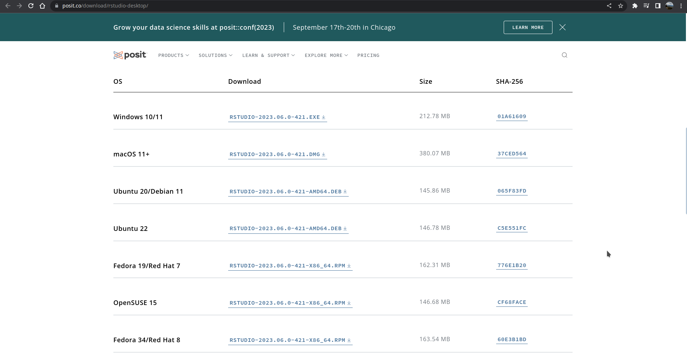

## Paso 4. Instalar RStudio en Ubuntu Linux

### Instalar dependencias

Antes de instalar RStudio, es posible que debas instalar algunas dependencias en tu sistema. Abre la terminal y ejecuta los siguientes comandos para instalar las dependencias requeridas:

``` bash
sudo apt update
sudo apt install gdebi-core
```

Estos comandos actualizarán los repositorios de paquetes y luego instalarán `gdebi-core`, una utilidad necesaria para instalar paquetes `.deb` de forma sencilla y para resolver dependencias automáticamente.

### Instalar RStudio

Una vez que hayas descargado el archivo de instalación de RStudio y hayas instalado las dependencias necesarias, puedes proceder con la instalación. Ve al directorio donde descargaste el archivo de instalación y ejecuta el siguiente comando en la terminal:

``` bash
sudo gdebi <nombre_del_archivo_de_instalación>.deb
```

Reemplaza `<nombre_del_archivo_de_instalación>` con el nombre real del archivo de instalación descargado.

El comando `gdebi` instalará RStudio y resolverá automáticamente las dependencias necesarias.

## Paso 5. Iniciar RStudio

Una vez completada la instalación, puedes iniciar RStudio desde el menú de aplicaciones de Ubuntu o ejecutando el siguiente comando en la terminal:

``` bash
rstudio
```

RStudio se abrirá en una ventana separada, lo que te permitirá comenzar a trabajar con R y aprovechar todas las funciones y características que ofrece el IDE.

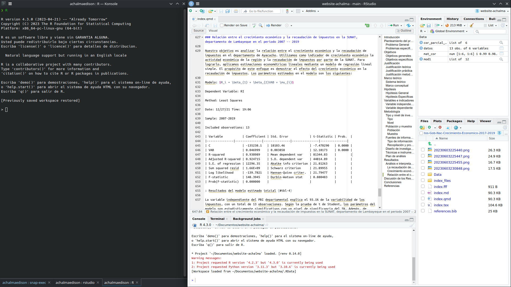

# ¿Qúe nos ofrece RStudio?

## Beneficios del software RStudio

RStudio es una herramienta poderosa que brinda numerosas ventajas para los usuarios. A continuación, destacamos algunas de las funcionalidades que ofrece:

1.  **Potente editor de código:** RStudio proporciona un entorno de desarrollo integrado (IDE) que cuenta con un editor de código robusto. Este editor permite escribir, editar y ejecutar código de manera eficiente, lo que facilita el trabajo con el lenguaje de programación R.

2.  **Gestión del espacio de trabajo:** RStudio ofrece características avanzadas para el manejo del espacio de trabajo. Puedes explorar y administrar fácilmente los objetos, variables y funciones utilizados en tu sesión de R, lo que facilita el seguimiento y la organización de tus datos y resultados.

3.  **Depuración y resaltado de sintaxis:** La función de depuración de RStudio te permite identificar y corregir errores en tu código de manera eficiente. Además, el resaltado de sintaxis te ayuda a visualizar y comprender mejor la estructura de tu código, lo que facilita su lectura y mantenimiento.

4.  **Autocompletado inteligente:** RStudio ofrece una función de autocompletado inteligente, que te sugiere opciones de código a medida que escribes. Esto acelera el proceso de codificación al proporcionar sugerencias contextuales y facilitar la escritura correcta de las funciones y objetos de R.

5.  **Interoperabilidad con otros software y plataformas:** RStudio es compatible con una amplia gama de herramientas y plataformas. Puedes integrar fácilmente tus análisis en flujos de trabajo existentes, colaborar con otros profesionales y compartir tus resultados en diferentes formatos, como informes, gráficos interactivos o aplicaciones web.

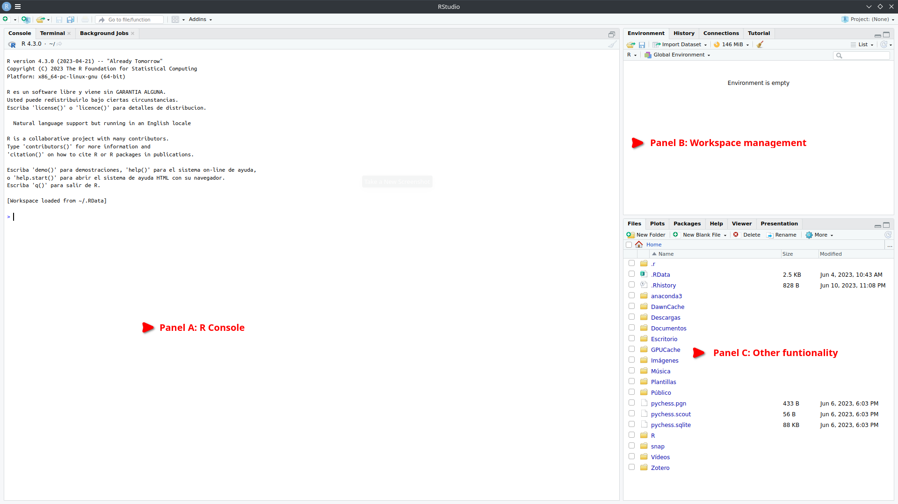

## Archivos de Script en R (.R)

En el mundo del análisis de datos y programación en R, los archivos de script (.R) desempeñan un papel fundamental. Estos archivos contienen la secuencia de comandos necesaria para realizar análisis y manipulación de datos de manera sistemática y reproducible.

### Ventajas de utilizar archivos de script en R:

1.  **Documentación de tareas**: Al escribir nuestros comandos en un archivo de script, estamos creando una documentación detallada de los pasos y procesos utilizados en nuestro análisis. Esto facilita la comprensión y revisión de nuestro trabajo, tanto para nosotros mismos como para otros colaboradores.

2.  **Automatización de tareas repetitivas**: Los archivos de script permiten automatizar tareas que se repiten con frecuencia. Podemos definir una serie de comandos en el archivo y ejecutarlos de forma rápida y eficiente cada vez que sea necesario. Esto ahorra tiempo y reduce la posibilidad de errores.

3.  **Evaluación de cambios**: Al tener nuestros comandos en un archivo de script, podemos realizar modificaciones y ajustes en el análisis de manera más ágil. Podemos realizar pruebas y evaluaciones de los cambios sin necesidad de volver a escribir todo el código desde cero. Esto nos brinda flexibilidad y nos permite iterar y mejorar nuestro análisis de manera más eficiente.

### Creando y Ejecutando un Script en RStudio

Los scripts nos permiten escribir y ejecutar una serie de comandos de manera secuencial, lo que facilita la automatización y reproducción de tareas en nuestros análisis de datos.

**Paso 1: Crear un nuevo archivo de script**

En primer lugar, abrimos RStudio y creamos un nuevo archivo de script. Para hacer esto, seleccionamos "Archivo" en la barra de menú, luego "Nuevo archivo" y finalmente "Script R". Esto abrirá un nuevo editor de texto donde podemos escribir nuestro código.


**Paso 2: Escribir el código en el script**

Una vez que tenemos nuestro archivo de script abierto, podemos comenzar a escribir nuestro código en R. Podemos utilizar cualquier comando o función de R en el script para realizar análisis de datos, manipulación de variables, visualización, entre otros. Es importante asegurarse de que el código esté escrito correctamente y tenga una sintaxis válida.

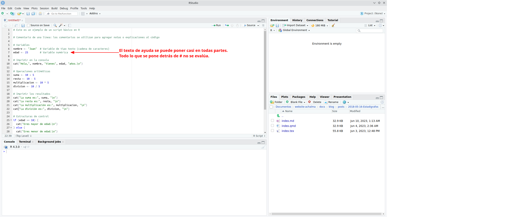


::: {.cell}

```{.r .cell-code}
# Este es un ejemplo de un script básico en R

# Comentario de una línea: los comentarios se utilizan para agregar notas o explicaciones al código

# Variables
nombre <- "Juan" # Variable de tipo texto (cadena de caracteres)
edad <- 25 # Variable numérica

# Imprimir en la consola
cat("Hola,", nombre, "tienes", edad, "años.\n")

# Operaciones aritméticas
suma <- 10 + 5
resta <- 10 - 5
multiplicacion <- 10 * 5
division <- 10 / 5

# Imprimir los resultados
cat("La suma es:", suma, "\n")
cat("La resta es:", resta, "\n")
cat("La multiplicación es:", multiplicacion, "\n")
cat("La división es:", division, "\n")
```
:::


**Paso 3: Ejecutar el script**

Una vez que hemos escrito nuestro código en el archivo de script, podemos ejecutarlo para obtener los resultados deseados. Para hacer esto, podemos utilizar el atajo de teclado "Ctrl + Enter" o simplemente hacer clic en el botón "Ejecutar" en la parte superior del editor de texto.


RStudio ejecutará el código línea por línea y mostrará los resultados en la consola.


**Paso 4: Guardar el script**

Es importante guardar regularmente nuestro script para evitar perder nuestro trabajo. Para guardar el archivo de script, seleccionamos "Archivo" en la barra de menú y luego "Guardar" o "Guardar como".

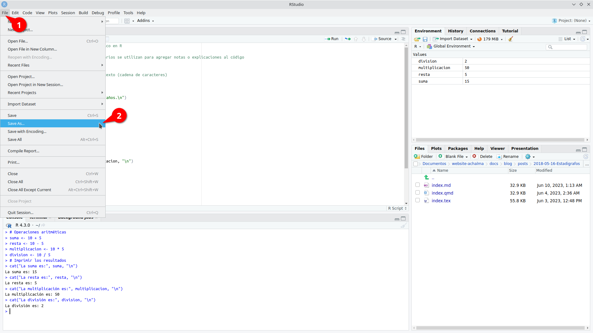

Podemos elegir una ubicación y un nombre de archivo apropiados para guardar nuestro script.

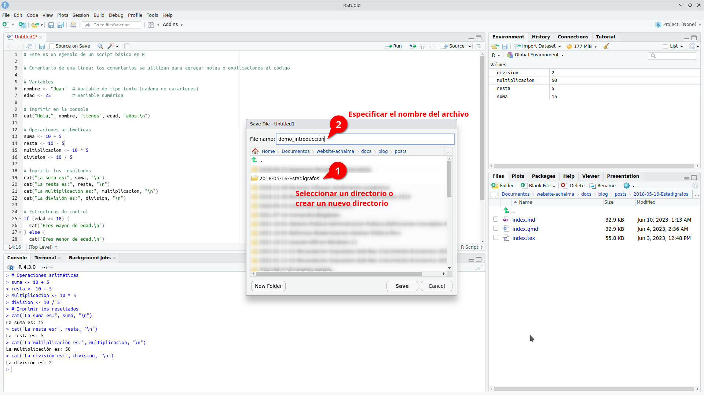

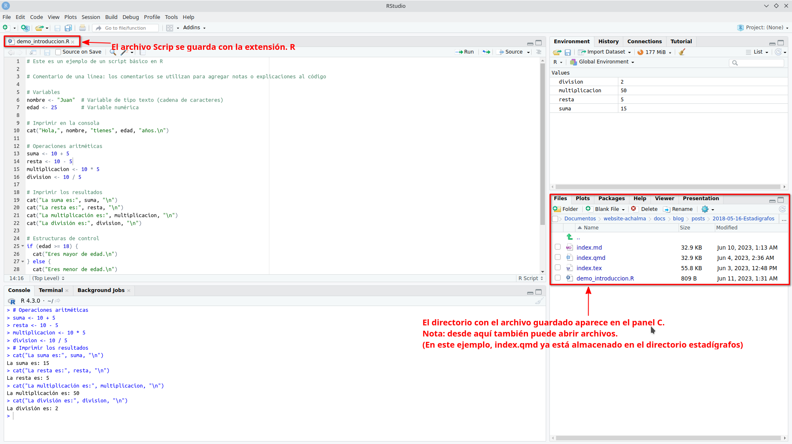

**Paso 5: Continuar escribiendo y ejecutando el código**

Podemos continuar escribiendo y ejecutando más código en nuestro script según nuestras necesidades. Podemos agregar nuevas líneas de código, modificar las existentes o eliminar las que ya no necesitamos. Es recomendable guardar el script regularmente a medida que realizamos cambios.

**Paso 6: Exportar los resultados (opcional)**

Si deseamos guardar los resultados de nuestro análisis, podemos exportarlos a archivos o formatos específicos. Por ejemplo, podemos guardar tablas de datos en archivos CSV, gráficos en imágenes o informes en formatos de texto. Esto nos permite compartir y utilizar los resultados fuera de RStudio.

> Recuerda que practicar y experimentar con diferentes comandos y funciones en RStudio te ayudará a familiarizarte con el entorno y mejorar tus habilidades de programación en R. ¡Diviértete explorando el mundo del análisis de datos con RStudio!

## Shortcuts

Aquí tienes una tabla con algunos atajos de teclado útiles en RStudio para usuarios de Ubuntu Linux:

| Acción                                                                       | Atajo de teclado     |
|------------------------------------------------------|------------------|
| Ejecutar el código / selección actual y saltar a la línea siguiente          | Ctrl + Enter         |
| Ejecutar el código / selección actual y no saltar a la línea siguiente       | Alt + Enter          |
| Ejecutar línea de código                                                     | Shift + Enter        |
| Comentar/descomentar línea de código                                         | Ctrl + Shift + C     |
| Copiar línea de código                                                       | Ctrl + Shift + D     |
| Pegar línea de código                                                        | Ctrl + Shift + V     |
| Ir a la línea                                                                | Ctrl + G             |
| Ir al inicio del documento                                                   | Ctrl + Home          |
| Ir al final del documento                                                    | Ctrl + End           |
| Completar código                                                             | Tab                  |
| Abrir ayuda                                                                  | F1                   |
| Guardar el archivo actual                                                    | Ctrl + S             |
| Cerrar archivo                                                               | Ctrl + W             |
| Deshacer                                                                     | Ctrl + Z             |
| Rehacer                                                                      | Ctrl + Y             |
| Abrir consola de R                                                           | Ctrl + Shift + Enter |
| Buscar en el archivo                                                         | Ctrl + F             |
| Buscar y reemplazar en el archivo                                            | Ctrl + Shift + F     |
| Colapsar/expandir bloque de código                                           | Ctrl + Shift +       |
| Aumentar tamaño de fuente                                                    | Ctrl + +             |
| Disminuir tamaño de fuente                                                   | Ctrl + -             |
| Nuevo archivo Script R                                                       | Shift + Ctrl + N     |
| Abrir archivo                                                                | Ctrl + O             |
| Ejecutar todo el script                                                      | Ctrl + Alt + R       |
| Ejecutar el código desde el principio hasta la línea actual                  | Ctrl + Alt + B       |
| Ejecutar el código desde la línea actual hasta el final                      | Ctrl + Alt + E       |
| Mover el cursor al editor de código fuente                                   | Ctrl + 1             |
| Mover el cursor a la consola                                                 | Ctrl + 2             |
| Eliminar selección actual                                                    | Ctrl + D             |
| Limpiar consola                                                              | Ctrl + L             |
| Navegar por el historial de la consola                                       | arriba/abajo         |
| Mover la línea de código arriba y abajo (evita el trabajo de copiar y pegar) | Alt + arriba/abajo   |
| Interrumpir el comando en ejecución                                          | Esc                  |

Estos atajos de teclado te ayudarán a agilizar tu flujo de trabajo en RStudio en Ubuntu Linux. Recuerda que también puedes personalizar los atajos de teclado según tus preferencias en la sección de configuración de RStudio.

## Espacio de trabajo (.Rdata)

El espacio de trabajo en R consiste en todos los objetos que se crean o cargan durante una sesión de R.

### Creación de objetos de datos

1.  Utiliza el operador de asignación (`<-`) para crear un objeto de datos. Por ejemplo: `mi_objeto <- c(1, 2, 3, 4, 5)`.

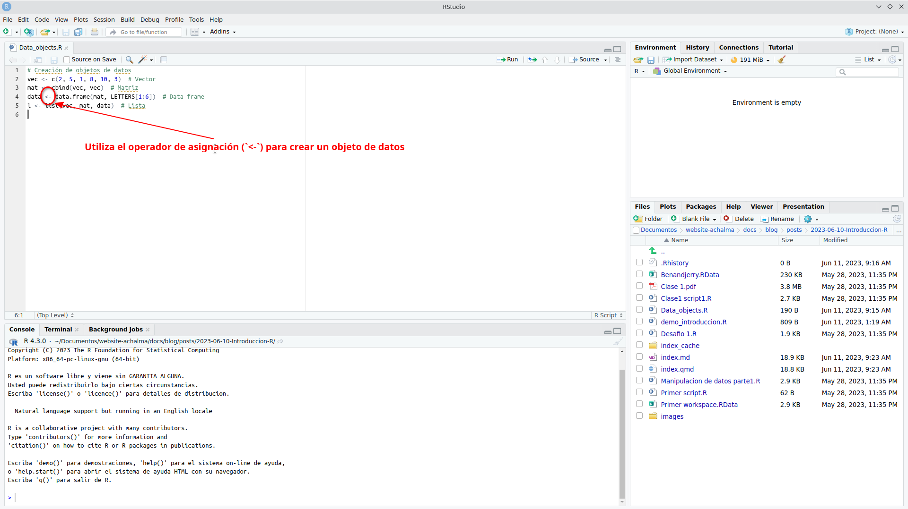

2.  Selecciona todo el código que contiene los objetos de datos y ejecútalo en la consola de RStudio.

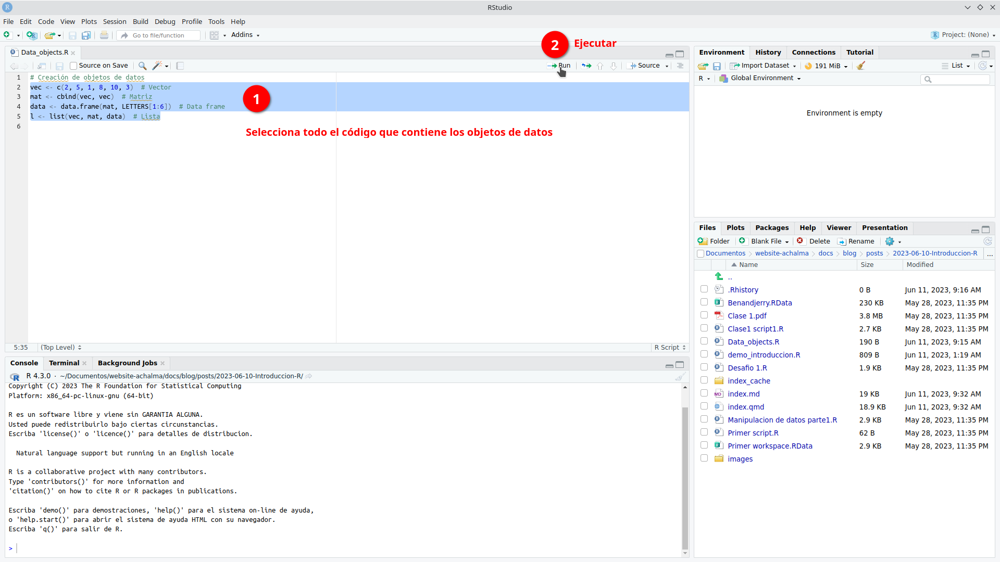

3.  El código se evaluará y los objetos de datos se crearán en el espacio de trabajo. Sin embargo, no verás ningún resultado en la consola.

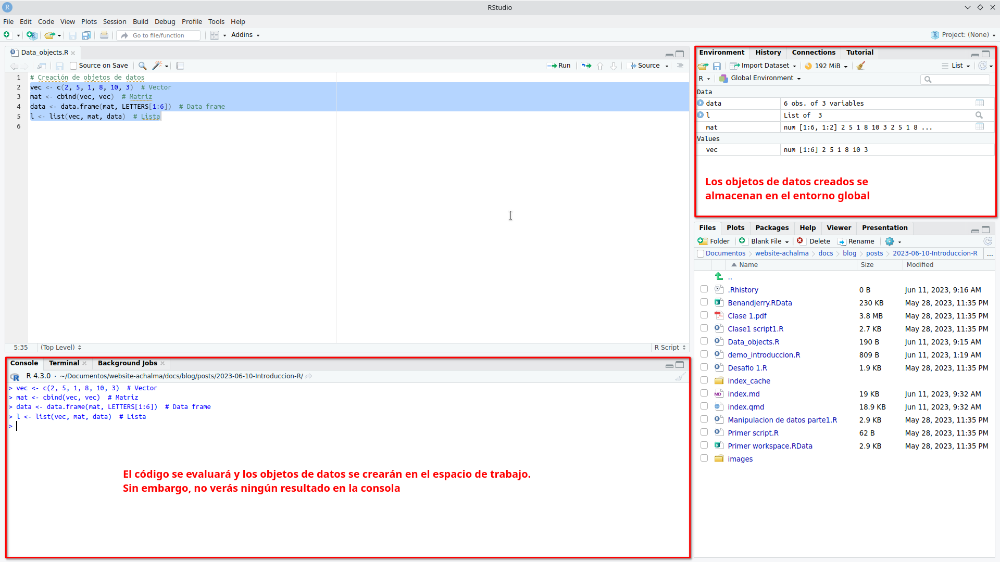

Los objetos de datos creados se almacenan en el entorno global, que es parte del espacio de trabajo de R.

### Inspección de objetos de datos

Puedes inspeccionar los objetos de datos haciendo clic sobre ellos en el panel de entorno o en el panel de objetos. Esto abrirá una vista previa del objeto en un nuevo archivo. Ten en cuenta que esta vista previa no afecta los objetos en el espacio de trabajo y se puede cerrar sin perder ninguna información.

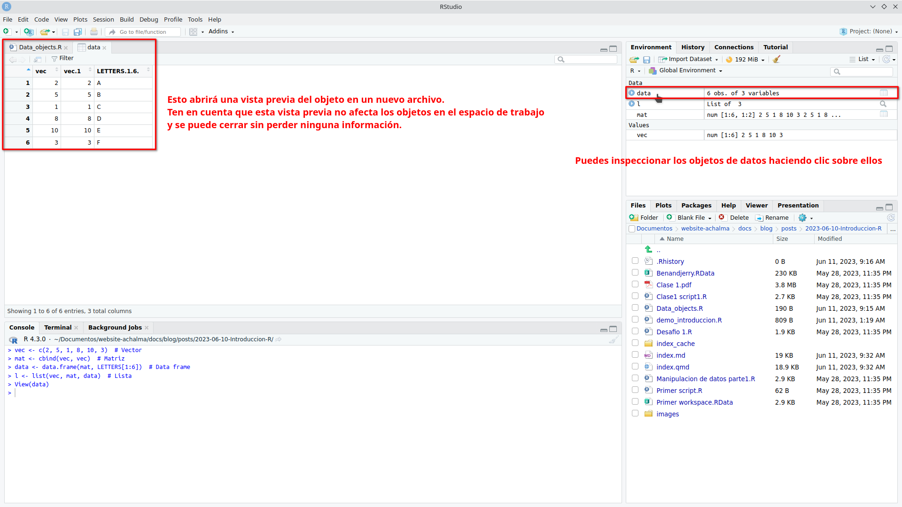

### Guardado del espacio de trabajo

En RStudio, puedes guardar todos los objetos en tu espacio de trabajo en un archivo llamado `.Rdata`. Esta función te permite almacenar y cargar el espacio de trabajo completo en futuras sesiones de RStudio.

Para guardar el espacio de trabajo, simplemente ve al menú "Session" y selecciona "Save Workspace As...". A continuación, elige la ubicación y el nombre de archivo deseados para guardar el archivo `.Rdata`.

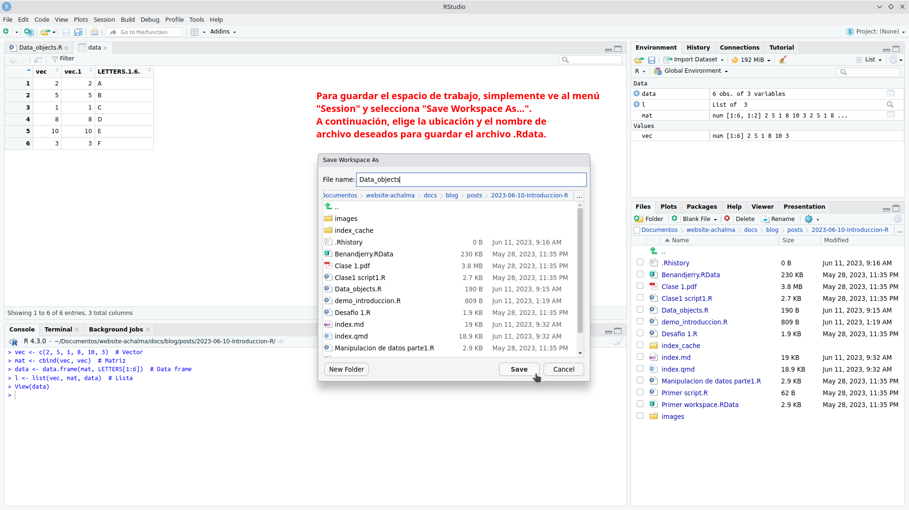

Esta función es especialmente útil cuando trabajas en proyectos largos o cuando deseas retomar tu trabajo en otro momento sin tener que volver a crear o cargar manualmente todos los objetos y configuraciones.

> Recuerda que al guardar y cargar el espacio de trabajo, asegúrate de mantener un respaldo de tus archivos en caso de cualquier eventualidad. ¡Disfruta de la conveniencia de mantener tus objetos y configuraciones en tu espacio de trabajo guardado!

### Carga del espacio de trabajo

Para cargar el espacio de trabajo previamente guardado, sigue estos pasos:

1.  Abre RStudio y ve al menú "Session" en la barra de herramientas superior.
2.  Selecciona la opción "Cargar" del menú desplegable.
3.  Aparecerá una ventana emergente que te permite buscar el archivo `.Rdata` que contiene tu espacio de trabajo guardado. Navega hasta la ubicación donde guardaste el archivo.
4.  Selecciona el archivo `.Rdata` y haz clic en el botón "Abrir".
5.  RStudio cargará automáticamente el archivo y restaurará todos los objetos y sus valores en tu entorno de trabajo actual.


Una vez completados estos pasos, podrás acceder a todos los objetos y continuar trabajando con ellos como lo hiciste en la sesión en la que guardaste el espacio de trabajo.

> ¡Con esta opción de carga, podrás retomar fácilmente tus proyectos anteriores y continuar donde lo dejaste sin tener que volver a crear los objetos desde cero!

## Historial (.Rhistory)

El archivo de historial es un archivo de texto que registra todos los comandos ejecutados durante una sesión de RStudio.

### Inspección del historial de comandos

Puedes ver el historial de comandos ejecutados durante tu sesión de trabajo haciendo clic en la pestaña "History" en la parte superior derecha de la ventana de RStudio. Aquí encontrarás una lista de todos los comandos ejecutados, lo que te permite revisarlos y volver a utilizarlos según sea necesario.

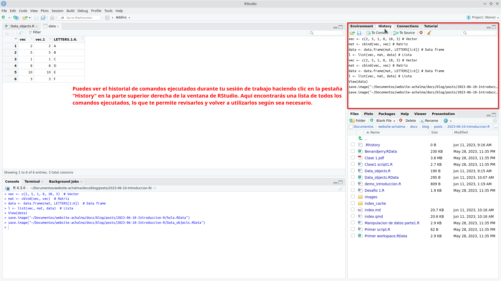

### Guardado del historial de comandos

Si deseas guardar tu historial de comandos, puedes hacerlo en cualquier momento durante tu sesión de trabajo. Esto te permitirá acceder a tus comandos previos en futuras sesiones.

Si deseas guardar tu historial de comandos en RStudio, sigue estos pasos:

1.  En el panel de superior derecha selecciona la opción "Save History" (Guardar Historial).
2.  Aparecerá una ventana emergente que te permitirá seleccionar la ubicación y el nombre de archivo para guardar tu historial de comandos. El archivo tendrá una extensión `.Rhistory` por defecto.
3.  Elige la ubicación donde deseas guardar el archivo y asigna un nombre descriptivo para identificarlo fácilmente.
4.  Haz clic en el botón "Guardar" para guardar el historial de comandos en el archivo seleccionado.


### Reutilización del historial de comandos

El historial se guarda en un archivo llamado `.Rhistory`. Puedes reutilizar todo el historial de comandos haciendo clic en el archivo `.Rhistory` o con el nombre asignado. Luego, puedes copiarlos y pegarlos en tu archivo de script actual.


Inserta un código de línea seleccionado de `.Rhistory` en un archivo de script nuevo.


> ¡Explora y aprovecha al máximo el espacio de trabajo y el historial en RStudio para mejorar tu flujo de trabajo y aprovechar al máximo tus comandos y objetos de datos!

# Lo que debemos saber

## Tipos de datos

En R, es fundamental comprender los diferentes tipos de datos disponibles. A continuación, exploraremos los tres tipos básicos de datos en R y cómo se utilizan en la programación.

### 1. Tipos de datos numéricos

Los datos numéricos en R se dividen en dos tipos principales:

a.  Números reales, se conoce como `double`. Estos son los números más comunes y se utilizan para representar valores decimales. Por ejemplo, 3.14 y 2.71828 son números reales en R. La precisión de los números reales en R depende de la máquina en la que se ejecuta el programa.

b.  Números enteros, se conoce como `integer`. Estos son números que no contienen decimales y se utilizan para representar valores enteros. Por ejemplo, 1, 2, -5 son ejemplos de números enteros en R. Los números enteros se utilizan cuando no se requiere precisión decimal.

### 2. Tipo de datos lógico

El tipo de dato lógico en R se conoce como `booleano`. Este tipo de dato puede tener uno de dos valores: TRUE o FALSE. Los valores booleanos se utilizan principalmente para realizar operaciones de comparación y evaluación lógica en los programas. Por ejemplo, se puede usar una expresión lógica para verificar si una condición es verdadera o falsa.

### 3. Tipo de datos carácter

El tipo de dato carácter en R se utiliza para almacenar letras `text` y símbolos `strings`. Los datos de tipo carácter se definen utilizando comillas simples ('') o comillas dobles (""). Por ejemplo,"Hola" y 'RStudio' son ejemplos de datos de tipo carácter en R. Los datos de tipo carácter se utilizan con frecuencia para almacenar texto legible por humanos, como nombres, descripciones o mensajes.

> Es importante comprender estos tipos de datos en R, ya que nos permiten manipular y realizar operaciones en los datos de manera adecuada. Cada tipo de dato tiene sus propias características y funciones asociadas que nos permiten realizar tareas específicas en la programación.

## Estructura de datos

Las estructuras de datos nos permiten organizar y manipular la información de manera eficiente. A continuación, exploraremos las principales estructuras de datos disponibles en R y cómo se utilizan en la programación.

### 1. Escalar

Un escalar es un dato individual, como un número o una palabra, que no está agrupado con otros elementos. En R, los escalares pueden ser de diferentes tipos de datos, como numéricos, lógicos o caracteres. Estos datos se utilizan cuando solo necesitamos almacenar una única observación.

### 2. Vector

Un vector es una colección ordenada de elementos del mismo tipo de dato. Puede contener números, valores lógicos o caracteres. En R, los vectores son utilizados para almacenar conjuntos de datos relacionados. Por ejemplo, podemos tener un vector de edades o un vector de nombres. Los vectores son una de las estructuras de datos más utilizadas en R y nos permiten realizar operaciones y cálculos de manera eficiente.

**Vectores**

Concatenación de elementos con **`c()`**: Se utiliza la función `c()` para concatenar elementos y crear vectores en R.


::: {.cell}

```{.r .cell-code}
c(0.5, 0.6, 0.25) # números decimales (double)
```

::: {.cell-output .cell-output-stdout}
```
[1] 0.50 0.60 0.25
```
:::

```{.r .cell-code}
c(9L, 10L, 11L, 12L, 13L) # números enteros (integer)
```

::: {.cell-output .cell-output-stdout}
```
[1]  9 10 11 12 13
```
:::

```{.r .cell-code}
c(9:13) # secuencia de números enteros (integer sequence)
```

::: {.cell-output .cell-output-stdout}
```
[1]  9 10 11 12 13
```
:::

```{.r .cell-code}
c(TRUE, FALSE, FALSE) # valores lógicos (logical)
```

::: {.cell-output .cell-output-stdout}
```
[1]  TRUE FALSE FALSE
```
:::

```{.r .cell-code}
c(1 + 0i, 2 + 4i) # números complejos (complex)
```

::: {.cell-output .cell-output-stdout}
```
[1] 1+0i 2+4i
```
:::

```{.r .cell-code}
c("a", "b", "c") # caracteres (character)
```

::: {.cell-output .cell-output-stdout}
```
[1] "a" "b" "c"
```
:::
:::


**Acciones con vectores**

1.  Asignar los vectores a nombres:

    Creamos un vector llamado "dbl" que contiene los números decimales 0.5, 0.6 y 0.25.


    ::: {.cell}
    
    ```{.r .cell-code}
    dbl <- c(0.5, 0.6, 0.25)
    ```
    :::


    Creamos un vector llamado "chr" que contiene los caracteres "a", "b" y "c".


    ::: {.cell}
    
    ```{.r .cell-code}
    chr <- c("a", "b", "c")
    ```
    :::


2.  Imprimir los vectores "dbl" y "chr" en la consola:

    Visualizamos en la consola el contenido del vector "dbl", que son los números decimales 0.5, 0.6 y 0.25.


    ::: {.cell}
    
    ```{.r .cell-code}
    dbl
    ```
    
    ::: {.cell-output .cell-output-stdout}
    ```
    [1] 0.50 0.60 0.25
    ```
    :::
    :::


    Visualizamos en la consola el contenido del vector "chr", que son los caracteres "a", "b" y "c".


    ::: {.cell}
    
    ```{.r .cell-code}
    chr
    ```
    
    ::: {.cell-output .cell-output-stdout}
    ```
    [1] "a" "b" "c"
    ```
    :::
    :::


3.  Verificar el número de elementos en "dbl" y "chr":

    Calculamos y mostramos en la consola la longitud del vector "dbl", que es 3.


    ::: {.cell}
    
    ```{.r .cell-code}
    length(dbl)
    ```
    
    ::: {.cell-output .cell-output-stdout}
    ```
    [1] 3
    ```
    :::
    :::


    Calculamos y mostramos en la consola la longitud del vector "chr", que es 3.


    ::: {.cell}
    
    ```{.r .cell-code}
    length(chr)
    ```
    
    ::: {.cell-output .cell-output-stdout}
    ```
    [1] 3
    ```
    :::
    :::


4.  Verificar el tipo de dato de "dbl" y "chr":

    Visualizamos en la consola el tipo de dato del vector "dbl", que es "double" (números decimales).


    ::: {.cell}
    
    ```{.r .cell-code}
    typeof(dbl)
    ```
    
    ::: {.cell-output .cell-output-stdout}
    ```
    [1] "double"
    ```
    :::
    :::


    Visualizamos en la consola el tipo de dato del vector "chr", que es "character" (caracteres).


    ::: {.cell}
    
    ```{.r .cell-code}
    typeof(chr)
    ```
    
    ::: {.cell-output .cell-output-stdout}
    ```
    [1] "character"
    ```
    :::
    :::


5.  Combinar dos vectores:

    Se puede combinar el vector "dbl" consigo mismo utilizando la función "c()", creando un nuevo vector que contiene los elementos duplicados del vector original.


    ::: {.cell}
    
    ```{.r .cell-code}
    c(dbl, dbl)
    ```
    
    ::: {.cell-output .cell-output-stdout}
    ```
    [1] 0.50 0.60 0.25 0.50 0.60 0.25
    ```
    :::
    :::


    Tambien se puede combina el vector "dbl" con el vector "chr" utilizando la función "c()", creando un nuevo vector que contiene los elementos de ambos vectores concatenados.


    ::: {.cell}
    
    ```{.r .cell-code}
    c(dbl, chr)
    ```
    
    ::: {.cell-output .cell-output-stdout}
    ```
    [1] "0.5"  "0.6"  "0.25" "a"    "b"    "c"   
    ```
    :::
    :::


::: callout-note
El cambio automático del tipo de datos del vector resultante se denomina coerción. La coerción garantiza que se mantiene el mismo tipo de datos para cada elemento del vector.
:::

**Operaciones aritméticas con vectores**

1.  Definamos dos nuevos vectores numéricos llamados `a` y `b` con 4 elementos cada uno:


    ::: {.cell}
    
    ```{.r .cell-code}
    a <- c(1, 2, 3, 4)
    b <- c(10, 20, 30, 40)
    ```
    :::


2.  Realizamos una multiplicación escalar de `a` por 5, lo que significa que cada elemento en `a` se multiplica por 5:


    ::: {.cell}
    
    ```{.r .cell-code}
    a * 5
    ```
    
    ::: {.cell-output .cell-output-stdout}
    ```
    [1]  5 10 15 20
    ```
    :::
    :::


3.  Realizamos una multiplicación de vectores entre `a` y `b`, lo que implica multiplicar cada elemento en `a` por el elemento correspondiente en `b`:


    ::: {.cell}
    
    ```{.r .cell-code}
    a * b
    ```
    
    ::: {.cell-output .cell-output-stdout}
    ```
    [1]  10  40  90 160
    ```
    :::
    :::


4.  Creamos un nuevo vector numérico llamado `v` con longitud 5.


    ::: {.cell}
    
    ```{.r .cell-code}
    v <- c(1.1, 1.2, 1.3, 1.4, 1.5)
    a * v
    ```
    
    ::: {.cell-output .cell-output-stdout}
    ```
    [1] 1.1 2.4 3.9 5.6 1.5
    ```
    :::
    :::


::: callout-note
Las operaciones aritméticas de los vectores se realizan por elementos. si dos vectores no tienen la misma longitud, el vector más corto se reciclará para que coincida con el más largo (en este caso, se vuelve a utilizar el primer elemento de a).
:::

### 3. Matriz

Una matriz es una estructura bidimensional que contiene elementos organizados en filas y columnas. Todos los elementos de una matriz deben ser del mismo tipo de dato. Las matrices son útiles para almacenar datos tabulares, como una tabla de datos con variables en filas y observaciones en columnas. En R, podemos realizar operaciones matriciales y manipular los datos de manera eficiente utilizando esta estructura.

**Matrices**

1.  Combinamos los vectores `a` y `b`, definidas anteriormente, por columnas utilizando la función `cbind()`:


    ::: {.cell}
    
    ```{.r .cell-code}
    A <- cbind(a, b)
    A
    ```
    
    ::: {.cell-output .cell-output-stdout}
    ```
         a  b
    [1,] 1 10
    [2,] 2 20
    [3,] 3 30
    [4,] 4 40
    ```
    :::
    :::


    Esta opción combina los vectores `a` y `b` por columnas, creando una matriz `A` donde los elementos de `a` forman la primera columna y los elementos de `b` forman la segunda columna.

2.  Combinamos los vectores `a` y `b` por filas utilizando la función `rbind()`:


    ::: {.cell}
    
    ```{.r .cell-code}
    B <- rbind(a, b)
    B
    ```
    
    ::: {.cell-output .cell-output-stdout}
    ```
      [,1] [,2] [,3] [,4]
    a    1    2    3    4
    b   10   20   30   40
    ```
    :::
    :::


    En esta opción, los vectores `a` y `b` se combinan por filas para crear una matriz `B`. Los elementos de `a` forman la primera fila y los elementos de `b` forman la segunda fila.

3.  Creamos una matriz a partir de los elementos de vector `a` utilizando la función `matrix()`:


    ::: {.cell}
    
    ```{.r .cell-code}
    A <- matrix(a, ncol = 2, nrow = 2)
    A
    ```
    
    ::: {.cell-output .cell-output-stdout}
    ```
         [,1] [,2]
    [1,]    1    3
    [2,]    2    4
    ```
    :::
    :::


    Aquí se utiliza la función `matrix()` para crear una matriz `A` a partir de los elementos del vector `a`. Se especifica que la matriz tendrá 2 columnas y 2 filas. Los argumentos nrow y ncol indican el número de filas y el número de columnas de que consta la matriz resultante.

4.  Para 4 elementos y ncol =2 la matriz sólo puede tener 2 filas. Por lo tanto no es necesario especificar ambos argumentos


    ::: {.cell}
    
    ```{.r .cell-code}
    A <- matrix(a, ncol = 2)
    A
    ```
    
    ::: {.cell-output .cell-output-stdout}
    ```
         [,1] [,2]
    [1,]    1    3
    [2,]    2    4
    ```
    :::
    :::


    En esta variante, se crea una matriz `A` con 2 columnas y se ajusta automáticamente el número de filas según la longitud del vector `a`.

5.  Por defecto la matriz se rellena columna a columna (R trata internamente un objeto matriz como vector columna). si la matriz debe rellenarse fila a fila se requiere el argumento `byrow = TRUE`


    ::: {.cell}
    
    ```{.r .cell-code}
    B <- matrix(a, ncol = 2, byrow = TRUE)
    B
    ```
    
    ::: {.cell-output .cell-output-stdout}
    ```
         [,1] [,2]
    [1,]    1    2
    [2,]    3    4
    ```
    :::
    :::


    En esta opción, se crea una matriz `B` con 2 columnas y se especifica que los elementos del vector `a` se distribuirán por filas `byrow = TRUE`, es decir, los primeros elementos de `a` formarán la primera fila, los siguientes elementos formarán la segunda fila, y así sucesivamente.

**Acciones con matrices**

1.  Verificamos el número de filas de la matriz `A` utilizando la función `nrow()`:


    ::: {.cell}
    
    ```{.r .cell-code}
    nrow(A)
    ```
    
    ::: {.cell-output .cell-output-stdout}
    ```
    [1] 2
    ```
    :::
    :::


    Esta línea de código devuelve el número de filas de la matriz `A`.

2.  Verificamos el número de columnas de la matriz `A` utilizando la función `ncol()`:


    ::: {.cell}
    
    ```{.r .cell-code}
    ncol(A)
    ```
    
    ::: {.cell-output .cell-output-stdout}
    ```
    [1] 2
    ```
    :::
    :::


    Aquí se obtiene el número de columnas de la matriz `A`.

3.  Verificamos la dimensión (número de filas y columnas) de la matriz `A` utilizando la función `dim()`:


    ::: {.cell}
    
    ```{.r .cell-code}
    dim(A)
    ```
    
    ::: {.cell-output .cell-output-stdout}
    ```
    [1] 2 2
    ```
    :::
    :::


    Esta línea de código devuelve la dimensión de la matriz `A` en formato `[nrow, ncol]`.

4.  Combinamos dos matrices `A` por columnas utilizando la función `cbind()` y almacenamos el resultado en `D.wide`:


    ::: {.cell}
    
    ```{.r .cell-code}
    D.wide <- cbind(A, A)
    D.wide
    ```
    
    ::: {.cell-output .cell-output-stdout}
    ```
         [,1] [,2] [,3] [,4]
    [1,]    1    3    1    3
    [2,]    2    4    2    4
    ```
    :::
    :::


    En esta línea se crea una nueva matriz `D.wide` que combina las matrices `A` y `A` por columnas.

5.  Combinamos dos matrices `A` por filas utilizando la función `rbind()` y almacenamos el resultado en `D.long`:


    ::: {.cell}
    
    ```{.r .cell-code}
    D.long <- rbind(A, A)
    D.long
    ```
    
    ::: {.cell-output .cell-output-stdout}
    ```
         [,1] [,2]
    [1,]    1    3
    [2,]    2    4
    [3,]    1    3
    [4,]    2    4
    ```
    :::
    :::


    Aquí se crea una nueva matriz `D.long` que combina las matrices `A` y `A` por filas.

6.  Combinamos las matrices `D.wide` y `D.long` por columnas utilizando la función `cbind()` y almacenamos el resultado en `D`:


    ::: {.cell}
    
    ```{.r .cell-code}
    # D <- cbind(D.wide, D.long)
    ```
    :::


    En esta línea se crea una nueva matriz `D` que combina las matrices `D.wide` y `D.long` por columnas.

**Operaciones aritméticas con matrices**

1.  Suma de la matriz `B` consigo misma utilizando el operador `+`:


    ::: {.cell}
    
    ```{.r .cell-code}
    B + B
    ```
    
    ::: {.cell-output .cell-output-stdout}
    ```
         [,1] [,2]
    [1,]    2    4
    [2,]    6    8
    ```
    :::
    :::


    Esta línea de código realiza la suma de la matriz `B` con ella misma.

2.  Multiplicación escalar de la matriz `B` por 2 utilizando el operador `*`:


    ::: {.cell}
    
    ```{.r .cell-code}
    B * 2
    ```
    
    ::: {.cell-output .cell-output-stdout}
    ```
         [,1] [,2]
    [1,]    2    4
    [2,]    6    8
    ```
    :::
    :::


    Aquí se realiza la multiplicación de cada elemento de la matriz `B` por 2.

3.  Multiplicación elemento a elemento de la matriz `B` consigo misma y almacenar el resultado en `a`:


    ::: {.cell}
    
    ```{.r .cell-code}
    a <- B * B
    a
    ```
    
    ::: {.cell-output .cell-output-stdout}
    ```
         [,1] [,2]
    [1,]    1    4
    [2,]    9   16
    ```
    :::
    :::


    En esta línea se realiza la multiplicación elemento a elemento de la matriz `B` con ella misma, y el resultado se almacena en la matriz `a`.

4.  Multiplicación de matrices utilizando el operador `%*%`:


    ::: {.cell}
    
    ```{.r .cell-code}
    C <- B %*% B
    C
    ```
    
    ::: {.cell-output .cell-output-stdout}
    ```
         [,1] [,2]
    [1,]    7   10
    [2,]   15   22
    ```
    :::
    :::


    Aquí se realiza la multiplicación de matrices entre la matriz `B` y ella misma, y el resultado se almacena en la matriz `C`.

**Otras operaciones con matrices:**

1.  Transposición de la matriz `D.wide` utilizando la función `t()`:


    ::: {.cell}
    
    ```{.r .cell-code}
    t(D.wide)
    ```
    
    ::: {.cell-output .cell-output-stdout}
    ```
         [,1] [,2]
    [1,]    1    2
    [2,]    3    4
    [3,]    1    2
    [4,]    3    4
    ```
    :::
    :::


    Esta línea de código transpone la matriz `D.wide`, es decir, intercambia las filas por columnas y viceversa.

2.  Cálculo del determinante de la matriz `B` utilizando la función `det()`:


    ::: {.cell}
    
    ```{.r .cell-code}
    det(B)
    ```
    
    ::: {.cell-output .cell-output-stdout}
    ```
    [1] -2
    ```
    :::
    :::


    Aquí se calcula el determinante de la matriz `B`.

3.  Cálculo de la inversa de la matriz `B` utilizando la función `solve()` (solo si el determinante es diferente de 0):


    ::: {.cell}
    
    ```{.r .cell-code}
    solve(B)
    ```
    
    ::: {.cell-output .cell-output-stdout}
    ```
         [,1] [,2]
    [1,] -2.0  1.0
    [2,]  1.5 -0.5
    ```
    :::
    :::


    En esta línea se calcula la inversa de la matriz `B`, siempre y cuando el determinante sea diferente de 0.

4.  Cálculo de los valores propios (eigenvalues) de una matriz cuadrada y simétrica utilizando la función `eigen()`:


    ::: {.cell}
    
    ```{.r .cell-code}
    eigen(B)
    ```
    
    ::: {.cell-output .cell-output-stdout}
    ```
    eigen() decomposition
    $values
    [1]  5.3722813 -0.3722813
    
    $vectors
               [,1]       [,2]
    [1,] -0.4159736 -0.8245648
    [2,] -0.9093767  0.5657675
    ```
    :::
    :::


    Aquí se calculan los valores propios de la matriz `B`. Esta operación solo es aplicable a matrices cuadradas y simétricas.

### 4. Data frame

Un data frame es una estructura similar a una matriz, pero más flexible. Puede contener columnas con diferentes tipos de datos, lo que lo hace ideal para almacenar conjuntos de datos heterogéneos. Los data frames son muy utilizados en el análisis de datos, ya que nos permiten manipular y explorar datos de manera eficiente. Podemos realizar operaciones de filtrado, selección y transformación en los data frames para obtener información significativa.

**Creación del data frame:**

1.  Creamos vectores con diferentes tipos de datos, como números decimales (`dbl`), números enteros (`int`), valores lógicos (`lgl`) y caracteres (`chr`):


    ::: {.cell}
    
    ```{.r .cell-code}
    dbl <- c(0.5, 0.6, 0.25, 1.2, 0.333) # números decimales (double)
    int <- c(9L, 10L, 11L, 12L, 13L) # números enteros (integer)
    lgl <- c(TRUE, FALSE, FALSE, TRUE, TRUE) # valores lógicos (logical)
    chr <- c("a", "b", "c", "d", "e") # caracteres (character)
    ```
    :::


    Cada vector tiene elementos que representan valores de su respectivo tipo de dato.

2.  Utilizamos la función `data.frame()` para combinar los vectores en un data frame llamado `df`:


    ::: {.cell}
    
    ```{.r .cell-code}
    df <- data.frame(dbl, int, lgl, chr)
    ```
    :::


    El data frame `df` se crea utilizando los vectores `dbl`, `int`, `lgl` y `chr` como columnas.

3.  Mostamos el contenido del data frame en la consola:


    ::: {.cell}
    
    ```{.r .cell-code}
    df
    ```
    
    ::: {.cell-output .cell-output-stdout}
    ```
        dbl int   lgl chr
    1 0.500   9  TRUE   a
    2 0.600  10 FALSE   b
    3 0.250  11 FALSE   c
    4 1.200  12  TRUE   d
    5 0.333  13  TRUE   e
    ```
    :::
    :::


    Esto imprime el contenido del data frame `df`.

**Acciones con data frames:**

1.  Verificamos el número de filas del data frame utilizando la función `nrow()`:


    ::: {.cell}
    
    ```{.r .cell-code}
    nrow(df)
    ```
    
    ::: {.cell-output .cell-output-stdout}
    ```
    [1] 5
    ```
    :::
    :::


    Esta línea de código devuelve el número de filas en el data frame `df`.

2.  Verificamos el número de columnas del data frame utilizando la función `ncol()`:


    ::: {.cell}
    
    ```{.r .cell-code}
    ncol(df)
    ```
    
    ::: {.cell-output .cell-output-stdout}
    ```
    [1] 4
    ```
    :::
    :::


    Aquí se obtiene el número de columnas en el data frame `df`.

3.  Verificamos la dimensión (número de filas y columnas) del data frame utilizando la función `dim()`:


    ::: {.cell}
    
    ```{.r .cell-code}
    dim(df)
    ```
    
    ::: {.cell-output .cell-output-stdout}
    ```
    [1] 5 4
    ```
    :::
    :::


    Esta línea de código devuelve la dimensión del data frame `df` en formato `[nrow, ncol]`, es decir, el número de filas y columnas que tiene el data frame.

### 5. Lista

Una lista es una estructura de datos genérica que puede contener diferentes objetos, como vectores, matrices, data frames o incluso otras listas. A diferencia de las otras estructuras, las listas no tienen restricciones en cuanto a los tipos de datos o la longitud de los componentes individuales. Las listas son muy flexibles y se utilizan cuando necesitamos almacenar objetos de diferentes tipos o estructuras complejas.

**Creación de la lista**

1.  Creamos una variable `a` que contiene un **escalar** de tipo entero (`1L`):


    ::: {.cell}
    
    ```{.r .cell-code}
    a <- 1L
    ```
    :::


2.  Creamos un **vector numérico** `dbl` con 5 elementos:


    ::: {.cell}
    
    ```{.r .cell-code}
    dbl <- c(0.5, 0.6, 0.25, 1.2, 0.333)
    ```
    :::


3.  Creamos un **vector de caracteres** `chr` con 3 elementos:


    ::: {.cell}
    
    ```{.r .cell-code}
    chr <- c("a", "b", "c")
    ```
    :::


4.  Creamos un vector `v` con 4 elementos de tipo numérico:


    ::: {.cell}
    
    ```{.r .cell-code}
    v <- c(1.1, 1.2, 1.3, 1.4)
    ```
    :::


5.  Creamos una matriz `mat` de tamaño 2x2 a partir del vector `v`:


    ::: {.cell}
    
    ```{.r .cell-code}
    mat <- matrix(v, ncol = 2)
    ```
    :::


    La matriz `mat` tiene 2 columnas y los elementos del vector `v` se llenan por columnas.

6.  Creamos una lista `l` que contiene los elementos `a`, `dbl`, `chr` y `mat`:


    ::: {.cell}
    
    ```{.r .cell-code}
    l <- list(a, dbl, chr, mat)
    ```
    :::


    La lista `l` contiene estos elementos en ese orden.

7.  Finalmente, visualizamos el contenido de la lista en la consola:


    ::: {.cell}
    
    ```{.r .cell-code}
    l
    ```
    
    ::: {.cell-output .cell-output-stdout}
    ```
    [[1]]
    [1] 1
    
    [[2]]
    [1] 0.500 0.600 0.250 1.200 0.333
    
    [[3]]
    [1] "a" "b" "c"
    
    [[4]]
         [,1] [,2]
    [1,]  1.1  1.3
    [2,]  1.2  1.4
    ```
    :::
    :::


    Esto imprime el contenido de la lista `l`.

> Es importante comprender estas estructuras de datos en R, ya que nos permiten organizar y manipular la información de manera efectiva. Cada estructura tiene sus propias características y funciones asociadas que nos facilitan el trabajo con los datos en la programación.

# Manipulación de datos
